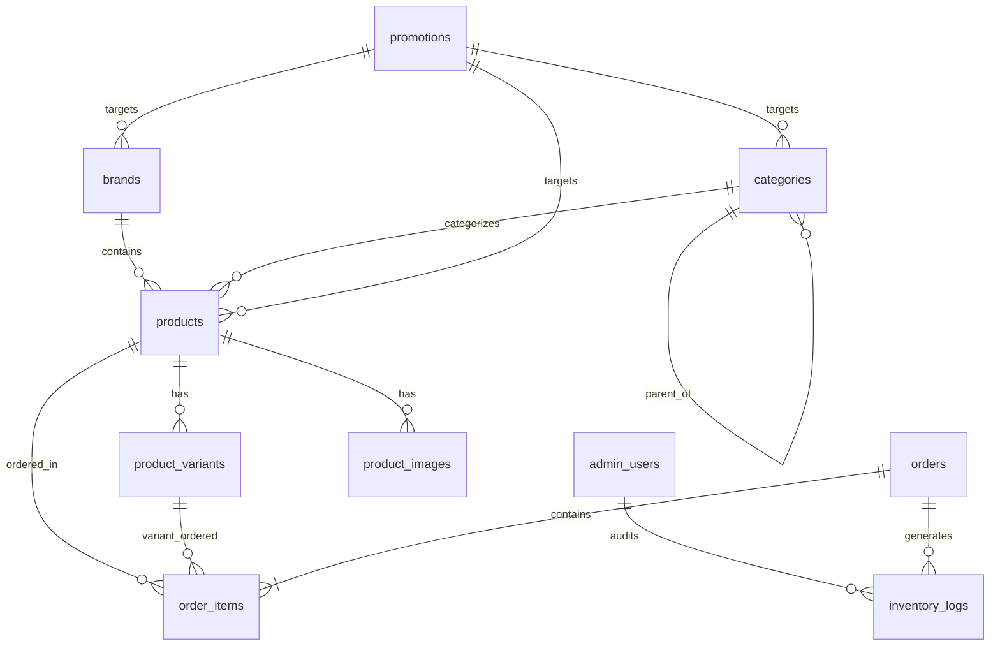

# Nexora Store — Database & Backend Architecture Documentation

## 1. Arquitectura Relacional (PostgreSQL / Supabase)

Esta base de datos ha sido estructurada bajo estándares de nivel **Senior / Enterprise**, implementando **Tercera Forma Normal (3NF)** para las operaciones de escritura (OLTP) y **Vistas Desnormalizadas Indexadas** para lectura ultrarrápida en el catálogo (OLAP / SSR / Edge Caching).

---

## 2. Inventario de Migraciones Versionadas

| Archivo | Objetivo Arquitectónico |
|---|---|
| `20260821000001_extensions_enums_auth.sql` | Extensiones UUID/pgcrypto, tipos ENUM nativos (`order_status_enum`, `payment_method_enum`), tabla `admin_users` vinculada a `auth.users` y función `is_admin()`. |
| `20260821000002_brands_categories_products_variants.sql` | Tablas normalizadas de `brands`, `categories` (soporte jerárquico), `products`, `product_variants` (SKU individual y stock por variante) y `product_images`. |
| `20260821000003_orders_order_items_inventory.sql` | Secuencia segura de órdenes `NX-100001`, tabla `orders`, tabla normalizada `order_items` con snapshot inmutable de precios, y tabla `inventory_logs` para auditoría de stock. |
| `20260821000004_promotions_and_settings.sql` | Campañas y cupones con claves foráneas hacia categorías/marcas/productos, y singleton `site_settings`. |
| `20260821000005_triggers_and_business_logic.sql` | Triggers de `updated_at`, sincronizador automático de conteo de productos en marcas/categorías, y trigger de deducción automática de inventario al crear `order_items`. |
| `20260821000006_views_and_analytics.sql` | Vistas desnormalizadas `view_catalog_products` (unifica producto + marca + categoría + variantes en un solo query JSON) y `view_store_kpis`. |
| `20260821000007_rls_security_policies.sql` | Políticas de Row Level Security (RLS) granulares para lectura pública e inserción/mutación exclusiva de administradores. |

---

## 3. Principios de Integridad y Reglas de Negocio

1. **Integridad Referencial Estricta**:
   * Borrar un producto elimina en cascada sus variantes (`product_variants`) e imágenes (`product_images`).
   * No se puede borrar una marca o categoría si tiene productos activos (`ON DELETE RESTRICT` o `SET NULL` controlado).
   * Un pedido almacena los `order_items` con `ON DELETE CASCADE` respecto a la orden, pero mantiene el `product_id` con `ON DELETE SET NULL` para preservar el historial de compras intacto aunque un producto sea dado de baja en el futuro.
2. **Snapshot Inmutable de Precios**:
   * Cada `order_item` almacena el `unit_price`, `product_name` y `product_sku` al momento exacto de la compra. Si el administrador cambia el precio del producto al día siguiente, el historial financiero de órdenes previas no se altera.
3. **Auditoría de Inventario Automatizada**:
   * Cada vez que se crea un item de orden, el trigger `trg_order_item_stock_deduction` descuenta las unidades de la variante y del producto, y genera un registro en `inventory_logs` con el delta, stock previo, nuevo stock y motivo `'order_placed'`.
4. **Vistas de Alto Rendimiento**:
   * La vista `view_catalog_products` permite a Next.js Server Components y Edge Routes consultar el catálogo completo con marcas, categorías y variantes en un **único query SQL indexado**, evitando el problema N+1.
